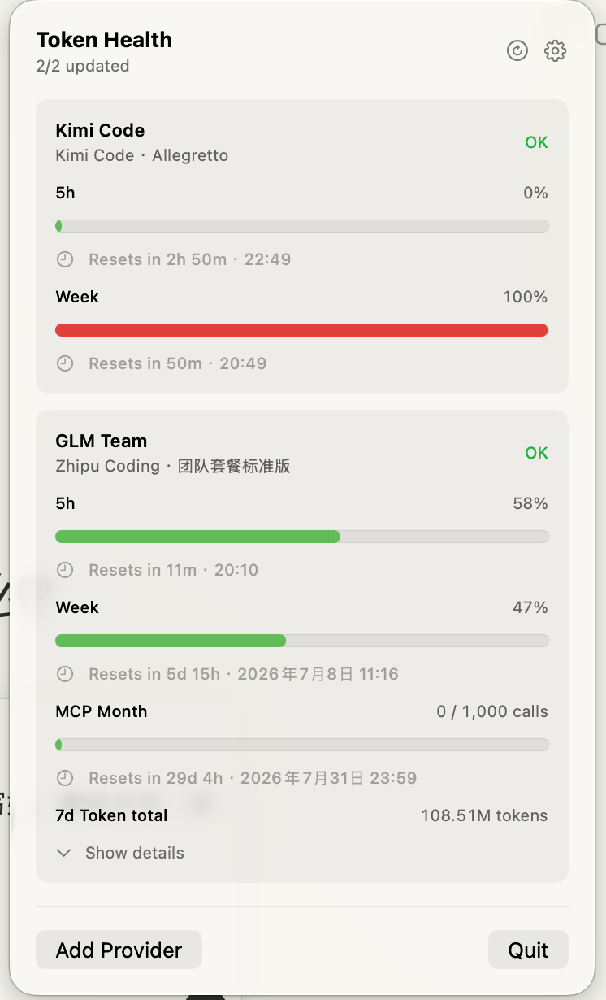

# Token Health

> macOS 菜单栏里的 AI Token 余额仪表盘，先照顾 Codex / Kimi Code / Zhipu Coding / MiniMax / Volcengine Ark 这类有滚动额度的 Coding 套餐。


<p align="center">
  
</p>

Token Health 是一个原生 SwiftUI 菜单栏 App，用来把 AI Coding 服务的短周期额度、周额度、重置时间和一些明细用一个小面板看清楚。Provider 卡片默认收起，保留最关键的额度条；点右侧箭头可以展开完整明细。它不做额度绕过，也不代理你的请求，只是读取你授权后的官方网页/API 数据并展示。

## 已支持

| Provider | 状态 | 能看到什么 | 认证方式 |
| --- | --- | --- | --- |
| Codex | 可用 | ChatGPT Codex 账号的短周期、周额度、重置倒计时和独立模型额度桶 | 复用本机 Codex 登录，仅通过官方 App Server 读取额度 |
| Kimi Code | 可用 | 5 小时窗口、周额度、重置倒计时 | Kimi Console Web 登录导入会话，或手动填 Bearer/Cookie |
| Zhipu Coding | 可用 | 5 小时窗口、周额度、MCP 月调用数、近 7 天 token/tool 明细 | BigModel Web 登录导入会话 |
| DeepSeek | 可用 | 余额、今日费用、今日 token / 请求明细 | DeepSeek Platform Web 登录导入会话；API key 模式可读官方余额 |
| MiniMax | 可用 | Token Plan 的 5 小时限额、周限额、视频赠送次数、积分余额、今日/近 7 天 token 明细 | MiniMax Platform Web 登录导入会话 |
| Volcengine Ark | 可用 | Agent Plan 的 5 小时、周、月 AFP 用量和重置时间 | 火山方舟控制台 Web 登录导入会话 |
| Generic HTTP | 可用 | 5 小时窗口、周额度、Token 总额度 | 自定义 JSON endpoint，可选 Bearer token |
| Demo | 可用 | 假数据，用来验证 UI | 无需凭证 |
| OpenAI API / Anthropic / Cursor | 占位 | 仅在你自己提供兼容 Generic HTTP 的 usage endpoint 时可用 | API endpoint + key |

## 暂不支持

- Windows / Linux / iOS，当前只支持 macOS 14+。
- OpenAI Platform API、Anthropic、Cursor 的官方用量接口适配器还没接上；Codex 的 ChatGPT 套餐额度已单独支持。
- 除 Kimi Code / Zhipu Coding / DeepSeek / MiniMax / Volcengine Ark 外，没有通用网页自动登录采集器。
- 多设备同步、云端存储、团队共享面板。
- 自动更新、正式签名和 Apple 公证发布包。
- 绕过额度、破解套餐、模拟付费权限。

## 安装和运行

可以从 GitHub Releases 下载最新的 `TokenHealth-*.dmg`，拖到 Applications 后运行。

```bash
git clone https://github.com/IMBlues/token-health.git
cd token-health
swift run TokenHealth
```

运行后会出现在 macOS 菜单栏。点闪电图标打开面板，点齿轮进入设置，添加 Provider 后刷新即可。

## 构建 App

```bash
bash scripts/build-app.sh
open ".build/app/Token Health.app"
```

构建 DMG：

```bash
bash scripts/build-dmg.sh
```

生成的 DMG 在 `dist/` 下。当前构建脚本只做本机 ad-hoc codesign，不是正式公证包。

## 配置说明

### Codex

添加计划后选择 `Codex`：

- 需要本机已经安装 OpenAI 官方签名的 ChatGPT 或 Codex 桌面端，并在 Codex 中通过 ChatGPT 账号登录。为避免执行被替换的程序，Token Health 不会自动运行 `PATH` 中的第三方或未签名 Codex CLI。
- Token Health 启动一个短生命周期的官方 `codex app-server` 子进程，只发送初始化握手和 `account/rateLimits/read`，不调用登录、登出、历史用量、额度重置、任务或文件接口。
- 自动刷新沿用全局 15 分钟间隔；一分钟内的重复 Codex 刷新复用最近结果或错误，不会连续启动额度查询。
- Token Health 不读取、复制或保存 Codex 登录凭证；凭证加载与必要的会话刷新仍由 Codex 自己管理。
- OpenAI API key 的按量计费与 ChatGPT Codex 套餐额度是两套体系，不会混在这个 Provider 中。

### Kimi Code

添加计划后选择 `Kimi Code`：

- 推荐点 `Login with Kimi Code`，在官方 Kimi Console 完成登录，然后点击导入会话。
- 也可以手动粘贴 Kimi Web Bearer token 或 `cookie:...` 到 API key 字段。
- 默认请求 Kimi Console 的用量接口；如果填了自定义 endpoint，则按 Generic HTTP 的 JSON 结构解析。

### Zhipu Coding

添加计划后选择 `Zhipu Coding`：

- 点 `Login with Zhipu Coding`，在 BigModel 用量页完成登录，然后导入会话。
- 会尝试读取套餐名、5 小时额度、周额度、MCP 月额度，以及近 7 天 token/tool 统计。

### DeepSeek

添加计划后选择 `DeepSeek`：

- 推荐把 `Auth` 切到 `Login`，点 `Login with DeepSeek`，在官方 DeepSeek Platform 完成登录并等用量页加载，然后导入会话。
- 会展示账户余额、今日费用、今日 token 和请求数，并把按模型拆分的今日明细放在详情里。
- 余额和今日费用默认会显示为 `¥¥¥`，需要点击旁边的小眼睛才会展开真实金额。
- 如果使用 `API` 模式，只会调用 DeepSeek 官方公开的 `/user/balance` 余额接口；官方公开文档暂未提供今日用量接口。

### MiniMax

添加计划后选择 `MiniMax`：

- 点 `Login with MiniMax`，在官方 MiniMax Platform 完成登录并等用量页加载，然后导入会话。
- 会展示 Token Plan 的 5 小时请求限额、周请求限额、视频赠送次数、积分余额、今日 token、近 7 天 token，以及今日 TOP 模型明细。

### Volcengine Ark

添加计划后选择 `Volcengine Ark`：

- 点 `Login with Volcengine Ark`，在火山方舟 Agent Plan 页面完成登录并等用量统计加载，然后导入会话。
- 会展示 Agent 燃料值（AFP）的近 5 小时、近一周、近一月用量和重置时间。

### Provider 排序

在 Settings 左侧列表里拖动 Provider 行右侧的排序柄，可以手动调整菜单面板中的展示顺序。排序会保存到本机配置。

### Generic HTTP

如果你有自己的用量服务，可以让它返回下面这种 JSON：

```json
{
  "fiveHours": {
    "used": 12000,
    "limit": 50000,
    "resetAt": "2026-07-02T12:00:00Z"
  },
  "week": {
    "used": 240000,
    "limit": 900000,
    "resetAt": "2026-07-06T00:00:00Z"
  }
}
```

字段名也兼容部分 snake_case 和嵌套形态，详见 `UsageJSONParser`。

也支持带 `data` 包装的总额度响应：

```json
{
  "code": true,
  "data": {
    "name": "Example User",
    "total_available": 298665817,
    "total_granted": 300803492,
    "total_used": 2137675,
    "unlimited_quota": false,
    "expires_at": 0
  },
  "message": "ok"
}
```

菜单卡片会显示已用比例（例如 `0.71%`）及对应进度；展开 Provider 后，会在进度条下方显示完整的 `2,137,675 / 300,803,492 tokens`。`data.name` 会显示在 Provider 副标题中。若没有 `total_granted`，会使用 `total_used + total_available` 推导总额度；若总额度未知、为 0 或为无限额度，则回退显示已使用的 Token 数量。

## 隐私和安全

- Token Health 没有自己的后端服务。
- 请求只会发往对应 Provider 官方接口，或你在 Generic HTTP 中配置的 endpoint。
- Codex Provider 通过本机官方 App Server 的私有 stdio 通道发送初始化与额度读取 RPC，并显式关闭该子进程的插件、Apps 和 analytics 功能；Codex 自身仍负责会话加载和必要刷新。
- API key、Cookie、Web session 等凭证存放在 macOS Keychain。
- Codex App Server 协议以及其他 Provider 的上游网页和内部接口都可能演进；这些适配器属于 best effort，失效时欢迎提 issue 或 PR。

## 开发

```bash
swift build
swift run TokenHealth
```

主要代码在 `Sources/TokenHealth/`：

- `StatusMenuView.swift`：菜单栏面板 UI。
- `SettingsView.swift`：Provider 配置 UI。
- `Providers.swift`：各 Provider 拉取和解析逻辑。
- `ConfigStore.swift` / `KeychainStore.swift`：本地配置和凭证存储。

## License

MIT
