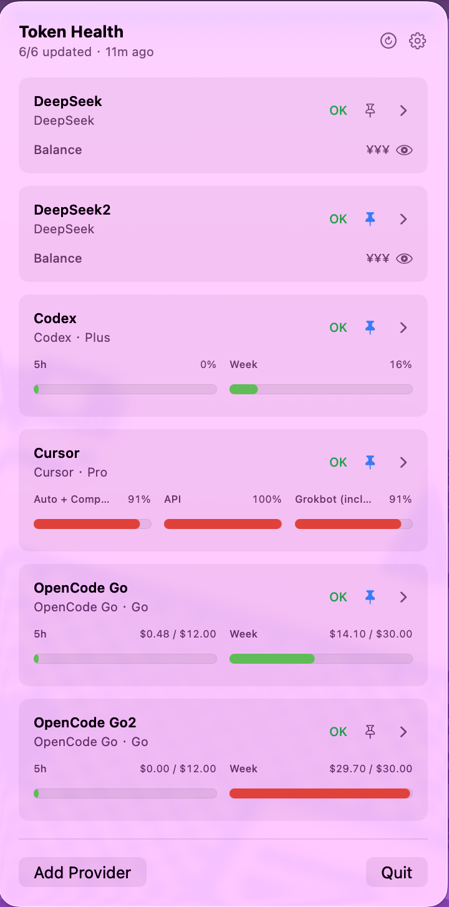
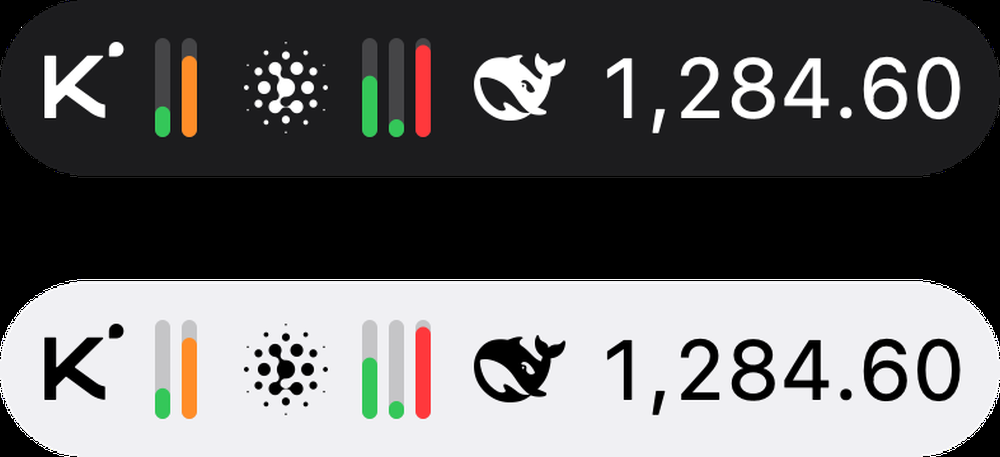

# Token Health

> **你的 AI 额度，抬眼就懂。**
>
> 原生 macOS 菜单栏仪表盘，给正在写代码的人。


<p align="center">
  
</p>

Token Health 读取官方用量，压成几张清爽的小卡片。不开代理，不碰请求，不做额度魔法，也没有自建后端。

把常看的账号钉到菜单栏，不点开也一眼看得到还剩多少 —— 左边是该 Provider 的官方 logo，
右边每个额度窗口一根细竖条，条越高用得越多：

<p align="center">
  
</p>

## 支持的服务

| Provider | 你能看到 |
| --- | --- |
| **Codex** | 短周期、周额度、模型额度桶、重置倒计时 |
| **Cursor** | 月度 Auto + Composer、API、Grokbot 用量 |
| **Kimi Code** | 5 小时、周额度 |
| **Zhipu Coding** | 5 小时、周额度、MCP 月额度、token/tool 明细 |
| **DeepSeek** | 余额、今日费用、token 与请求明细 |
| **MiniMax** | 5 小时、周额度、视频赠送、积分、token 明细 |
| **Volcengine Ark** | 5 小时、周、月 AFP 用量 |
| **OpenCode Go** | 5 小时、周、月美元额度 |
| **Generic HTTP** | 自定义 JSON 用量接口 |
| **Demo** | 用来试 UI 的安全假数据 |

凭证留在 macOS Keychain。Provider 会话只读，并且只发往对应服务的官方接口。

## 安装

从 [Releases](https://github.com/IMBlues/token-health/releases) 下载最新 DMG，把 **Token Health.app** 拖进 Applications，启动后它会安静地待在菜单栏。

## 从源码运行

```bash
git clone https://github.com/IMBlues/token-health.git
cd token-health
swift run TokenHealth
```

## 构建

```bash
# 构建并启动 App
bash scripts/build-app.sh
open ".build/app/Token Health.app"

# 构建可分发 DMG
bash scripts/build-dmg.sh
```

本机构建使用 ad-hoc 签名，未经过 Apple 公证。

## 使用

点齿轮添加 Provider，按提示登录，刷新即可。网页型服务从官方控制台导入会话；API 型服务在设置里填 key。

菜单顶部会标出最近一次刷新距今多久（`2/2 updated · 3m ago`）。自动刷新默认 15 分钟一次，打开菜单不会触发刷新；间隔可在设置 → General → Refresh 里自定义，最短 30 秒。

### Cursor

Token Health 从 Cursor 本地 `state.vscdb` 只读读取 access token，然后请求 Cursor 用量接口。接口提供独立数值时显示 Auto + Composer、API、Grokbot；如果 Cursor 把 Grokbot 合并进 Auto，会明确显示 **Grokbot (included in Auto)**，不会无声消失。

### OpenCode Go

支持 API key 或内置控制台登录，展示 Go 订阅的 5 小时（$12）、周（$30）、月（$60）额度。

### Generic HTTP

让你的接口返回这样的用量对象即可：

```json
{
  "fiveHours": { "used": 12000, "limit": 50000, "resetAt": "2026-07-02T12:00:00Z" },
  "week": { "used": 240000, "limit": 900000, "resetAt": "2026-07-06T00:00:00Z" }
}
```

### 钉住账号

在设置里打开 **Menu Bar → Pin to menu bar**，或者直接点下拉面板里每张卡片右上角的图钉 —— 两个入口等价。
每钉一个账号，菜单栏就多一个图标：左边是该 Provider 的官方 logo，右边是每个额度窗口一根细竖条，
条越高用得越多，颜色随用量从绿转橙转红，悬停可以看到各窗口的具体百分比。再点一次即取消钉住。

图标按设置里账号列表的顺序排列，数量不设上限 —— 菜单栏位置由系统排布，可以 ⌘ 拖拽调整。
原来的 `bolt.circle` 仍然是全局入口，两者互不影响。

DeepSeek 没有额度比例，钉住时直接显示余额数字（不带单位），并可以在设置里选显示币种（原币种 / CNY / USD）。
汇率每天从 ECB 数据源取一次，取不到就沿用上一次的缓存。换算只影响菜单栏那个数字，卡片与设置里始终显示原币种原值。

点钉住的 DeepSeek 项会弹出详情浮层：余额、`Today` 与 `This month` 的请求数 / tokens / 花费、本月按天趋势、
tokens 构成（`Output` / `Cache hit` / `Cache miss`），以及 `By model · this month` 的按模型拆分。
数据全部来自刷新时已经取回的那次响应，不额外发请求。

它只做展示 —— 没有筛选、没有日期范围、不能下钻。要看更细的分析请回厂商的控制台。
详情里的数字超过 5 分钟会在打开时自动刷新一次，右上角也可以手动刷新；取数失败时保留上一次的数字并标出错误。

DeepSeek 账号还可以在同一个分区里选显示币种（原币种 / CNY / USD）。汇率每天自动从 ECB 数据源取一次，
取不到时沿用上一次的缓存；首次使用又拿不到汇率时会用内置默认值，并在设置里明确标出。
换算只影响菜单栏那个数字，卡片与设置里始终显示原币种原值。

## 隐私

- 没有 Token Health 服务端，也没有云端同步。
- 凭证保存在 macOS Keychain。
- 请求只会发往你选择的 Provider，或你明确配置的 Generic HTTP / 上报接口。
- 只展示用量，不绕过限制、不伪造付费权限、不代理模型请求。

## 开发

```bash
swift build
bash scripts/test.sh
```

`scripts/test.sh` 只是把 CommandLineTools 里 swift-testing 的 `Testing.framework` 路径喂给 `swift test`。
没装 Xcode 的机器上直接用 `swift test` 会以 `no such module 'Testing'` 失败，看起来像代码坏了，其实不是。

这是一个小而原生的 SwiftUI 项目。入口从 `Sources/TokenHealth/StatusMenuView.swift`、`SettingsView.swift` 和各 Provider 实现开始。

## License

MIT
