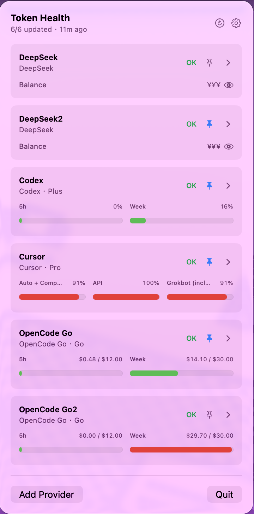
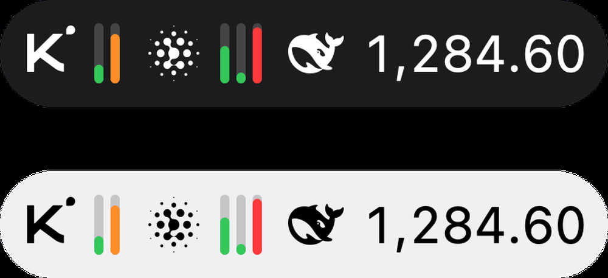

<p align="center">
  
</p>

# Token Health

> **你的 AI 额度，抬眼就懂。**
>
> 原生 macOS 菜单栏仪表盘，给正在写代码的人。

简体中文 | [English](README.en.md)


<p align="center">
  
</p>

Token Health 读取官方用量，压成几张清爽的小卡片。不开代理，不碰请求，不做额度魔法，也没有自建后端。

把常看的账号钉到菜单栏，不点开也一眼看得到还剩多少 —— 左边是该 Provider 的官方 logo，
右边每个额度窗口一根细竖条，条越高用得越多。最右边那枚葫芦是全局入口：

<p align="center">
  
</p>

## 支持的服务

| Provider | 你能看到 |
| --- | --- |
| **Codex** | 短周期、周额度、模型额度桶、重置倒计时 |
| **Cursor** | 月度 Auto + Composer、API 用量，外加 Grok Bot 自己那条独立的周额度；token 从本地 `state.vscdb` 只读读取，钉住后有 Grok Bot 按模型明细 |
| **Kimi Code** | 5 小时、周额度 |
| **Zhipu Coding** | 5 小时、周额度、MCP 月额度、token/tool 明细 |
| **DeepSeek** | 余额、今日费用、token 与请求明细 |
| **MiniMax** | 5 小时、周额度、视频赠送、积分、token 明细 |
| **Volcengine Ark** | 5 小时、周、月 AFP 用量 |
| **OpenCode Go** | 5 小时、周、月美元额度 |
| **Generic HTTP** | 自定义 JSON 用量接口 |
| **Demo** | 用来试 UI 的安全假数据 |

凭证留在 macOS Keychain。Provider 会话只读，并且只发往对应服务的官方接口。

加号菜单里还能选 **OpenAI** 和 **Anthropic** —— 这两项没有内置适配器：API 模式要你自己填一个用量接口（行为等同 Generic HTTP），控制台登录尚未接通。

## 安装

从 [Releases](https://github.com/IMBlues/token-health/releases) 下载最新 DMG，把 **Token Health.app** 拖进 Applications，启动后它会安静地待在菜单栏。

## 从源码运行

```bash
git clone https://github.com/IMBlues/token-health.git
cd token-health
swift run TokenHealth
```

## 构建

```bash
# 构建并启动 App
bash scripts/build-app.sh
open ".build/app/Token Health.app"

# 构建可分发 DMG
bash scripts/build-dmg.sh

# 构建 DMG，替换 /Applications 里的 App 并重启（本机自用）
bash scripts/install-release.sh
```

本机构建使用 ad-hoc 签名，未经过 Apple 公证。

## 使用

点齿轮添加 Provider，按提示登录，刷新即可。网页型服务从官方控制台导入会话；API 型服务在设置里填 key。

刷新默认 15 分钟一次，设置 → General → Refresh 可以改（最短 30 秒），打开菜单不会触发刷新。第一次读 Keychain 时 macOS 会弹授权框，被拒或超时后设置里会出现 **Retry Keychain Access**，点一下重新弹框就能当场恢复，不用重启。

### 钉住账号

在设置里打开 **Menu Bar → Pin to menu bar**，或者点下拉面板里每张卡片右上角的图钉。每钉一个账号，菜单栏就多一个图标：Provider logo 加每个额度窗口一根细竖条，条越高用得越多，颜色随用量由绿转橙转红，悬停能看到具体百分比；再点一次即取消。图标按账号列表的顺序排列，数量不限，位置由系统排布，可以 ⌘ 拖拽调整。

那枚葫芦是全局入口（它读的是葫芦里的水位，也就是余量），和钉住的账号互不影响。菜单栏图形只用黑白两色，竖条的绿/橙/红是唯一保留的颜色。

点钉住的项会弹详情浮层，比卡片再深一层。只有这四个有浮层：

| 钉住的账号 | 浮层里多出什么 |
| --- | --- |
| **Codex** | Token 汇总与每日趋势、`Lifetime` / `Peak day` / `Streak` / `Longest turn` |
| **Cursor** | Token 汇总与每日趋势、花费拆分、Grok bot 按模型用量 |
| **DeepSeek** | 余额与花费汇总、按天趋势、token 构成、按模型 / 按 key 拆分 |
| **OpenCode Go** | 请求数 / token / 花费、每日花费趋势、输入输出构成、按模型拆分 |

其余账号点开是一个小菜单（取消钉住 / 设置 / 退出）。浮层只做展示 —— 没有筛选、没有日期范围、不能下钻；数字超过 5 分钟会在打开时自动刷新一次，右上角也能手动刷新，取数失败就保留上一次的数字并标出错误。

DeepSeek 没有额度比例，钉住时直接显示余额数字，设置里可以选原币种 / CNY / USD（汇率每天从 ECB 取一次，取不到就沿用缓存）。浮层里的额度行画一条已用比例进度条，颜色与菜单栏、卡片同一套阈值；只有 DeepSeek 的余额行是纯文字 —— 余额报剩余、额度报已用，两种口径不硬凑成一种画法。

### Generic HTTP

让你的接口返回这样的用量对象即可：

```json
{
  "fiveHours": { "used": 12000, "limit": 50000, "resetAt": "2026-07-02T12:00:00Z" },
  "week": { "used": 240000, "limit": 900000, "resetAt": "2026-07-06T00:00:00Z" }
}
```

### 用量上报

设置侧栏的 **Integrations → Usage reporting** 把用量推给你自己的接口。打开 **Enabled**，勾上要上报的账号，填 **Endpoint**（只接受 `https://`）和 **Client ID**；**Bearer token**（存进 Keychain）与 **Pinned certificate SHA-256**（填了就只认这一张证书）可选。**Report now** 立刻推一次，每次整体刷新之后也会自动上报一次。

```json
{
  "client_id": "your-client-id",
  "accounts": [
    {
      "provider": "codex",
      "account_ref": "sha256:…",
      "display_name": "Codex · Pro",
      "plan": "Pro",
      "status": "ok",
      "windows": [
        { "name": "5h", "used_percent": 42, "resets_at": "2026-10-08T12:00:00Z" },
        { "name": "week", "used_percent": 18, "resets_at": "2026-10-13T00:00:00Z" }
      ]
    }
  ]
}
```

`account_ref` 是账号名的 SHA-256，不会把账号名原样发出去。只报 `5h` 与 `week` 两种窗口，百分比按 0–100 截断。

## 隐私

- 没有 Token Health 服务端，也没有云端同步。
- 凭证保存在 macOS Keychain。
- 请求只会发往你选择的 Provider，以及你自己填的 Generic HTTP 接口和用量上报 endpoint。
- 只展示用量，不绕过限制、不伪造付费权限、不代理模型请求。

## 开发

```bash
swift build
bash scripts/test.sh
```

`scripts/test.sh` 只是把 CommandLineTools 里 swift-testing 的 `Testing.framework` 路径喂给 `swift test`。
没装 Xcode 的机器上直接用 `swift test` 会以 `no such module 'Testing'` 失败，看起来像代码坏了，其实不是。

### provider 生命周期 QA

```bash
bash scripts/qa-provider-lifecycle.sh
```

添加 / 删除 provider 走的是 WebKit 的 per-identifier data store，而这条路上的崩溃**单元测试挡不住**：
swift-testing 进程不是真正的 App bundle，同样的调用在测试里永远是绿的，只有在真 App 里才段错误。
所以这个脚本真的构建、真的以 App 身份把「添加一个 provider、删掉它、再删一个从没建过会话的账号」跑一遍，
按退出码判定 —— 崩了就是 139。

它会把构建产物复制一份、换成 `local.token-health.qa` 再跑，不会动到你自己的 WebKit 数据。

这是一个小而原生的 SwiftUI 项目。入口是 `Sources/TokenHealth/TokenHealthApp.swift`；菜单栏那两处
（葫芦的下拉面板、钉住的账号项）由 `MenuBarPanelController.swift` 和 `PinnedStatusItemController.swift` 管理，
设置界面在 `SettingsView.swift`，取数实现在 `Providers.swift` 与几个 `*UsageProvider.swift` 里。

## License

MIT
